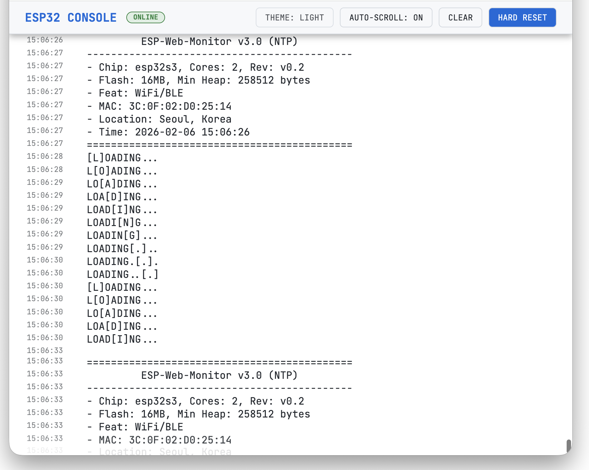
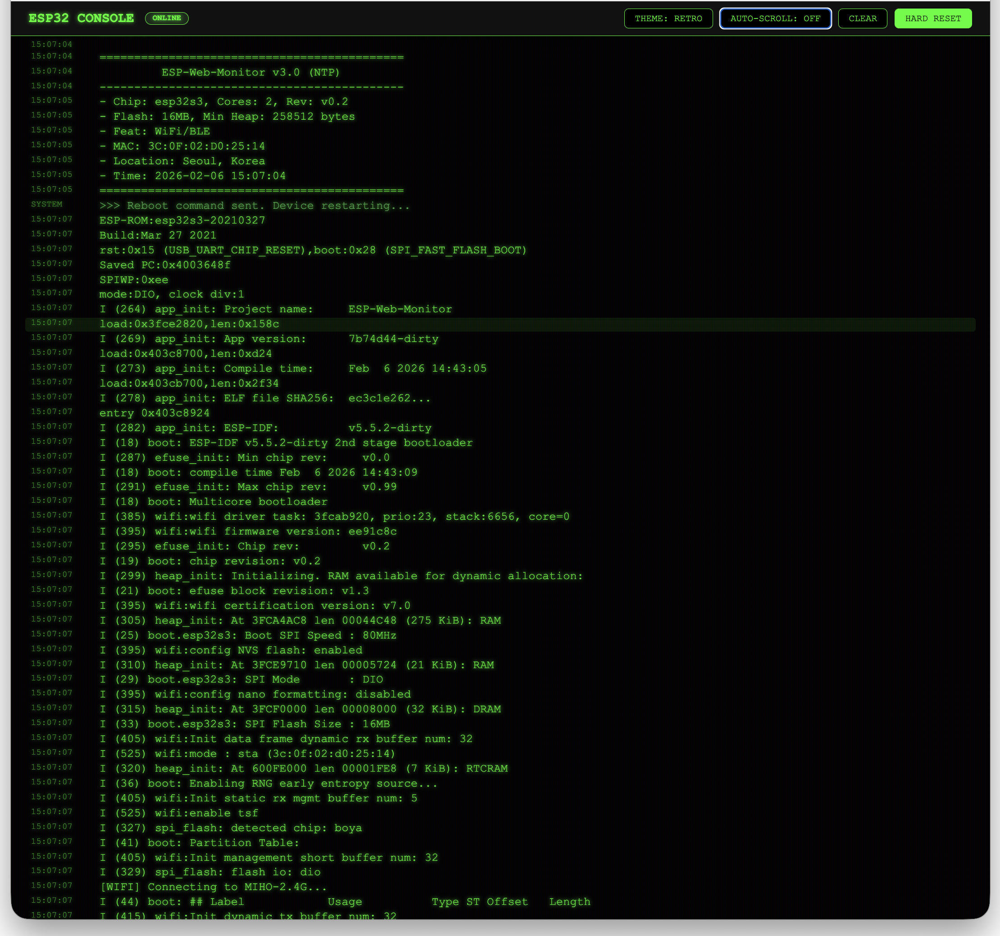
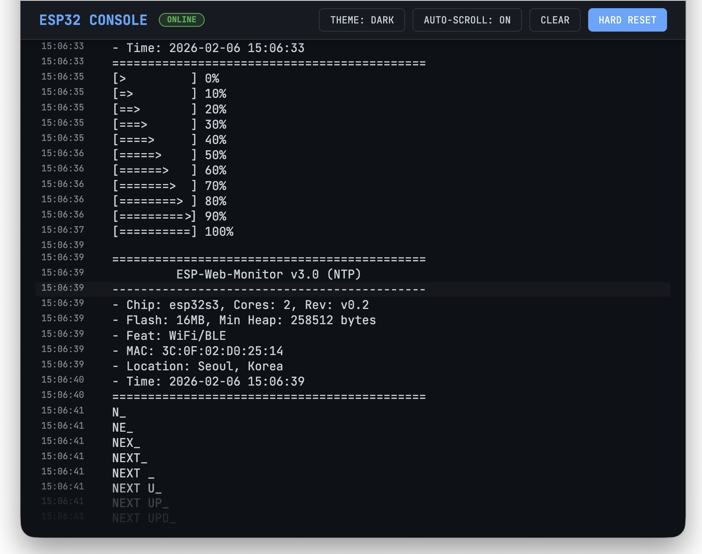

# ESP-Web-Monitor (Premium Serial Web Dashboard)

이 프로젝트는 ESP32의 시리얼 출력을 실시간으로 캡처하여 웹 브라우저에서 모니터링하고 제어할 수 있는 **고성능 웹 기반 개발 환경**입니다. ESP-IDF 인프라와 최적화된 Python Flask 엔진을 결합하여, 기존 터미널보다 강력하고 세련된 시각적 피드백과 0.1초 미만의 즉각적인 하드웨어 제어 기능을 제공합니다.

<p align="center">
  
  
  
</p>

---

## 🚀 주요 혁신 기능

## 🔐 Configuration (Security)

이 프로젝트는 보안을 위해 WiFi 정보를 별도 파일로 관리합니다. 빌드하기 전에 반드시 설정 파일을 생성해야 합니다.

**`hello_world/main/wifi_secrets.h` 파일 생성:**

```c
#ifndef WIFI_SECRETS_H
#define WIFI_SECRETS_H

#define WIFI_SSID      "YOUR_WIFI_SSID"
#define WIFI_PASS      "YOUR_WIFI_PASSWORD"

#endif
```

> **Note**: 이 파일은 `.gitignore`에 등록되어 있어 GitHub에 업로드되지 않습니다. 안심하고 설정하세요.

---

## 🚀 주요 혁신 기능 (v3.0 Update)

### 🎨 트리플 테마 엔진 (Theme Engine)

- **Dark Mode**: GitHub 스타일의 차분하고 가독성 높은 다크 테마 (기본).
- **Retro (CRT) Mode**: 80년대 해커 감성! 초록색 형광 텍스트, 스캔라인, 글로우 효과가 적용된 터미널 모드.
- **Light Mode**: 밝은 환경에서도 선명하게 보이는 깔끔한 화이트 테마.
- **Persistent State**: 선택한 테마는 브라우저에 저장되어 재접속 시에도 유지됩니다.

### 📊 스마트 시스템 모니터링

- **Detailed Info Box**: 칩 정보, Flash/PSRAM 용량, MAC 주소, 현재 시간(KST), 위치 정보를 박스 형태로 정렬하여 보여줍니다.
- **Visual Animations**: 단순한 텍스트를 넘어, 로딩 바(bar), 타이핑 효과, 매트릭스 비(rain) 등 5가지 텍스트 애니메이션이 순차적으로 실행되어 시각적 즐거움을 줍니다.
- **Typing Effect**: 정보 출력 시 타자기를 치듯 한 줄씩 출력되는 효과를 적용하여 가독성을 높이고 시리얼 버퍼 섞임을 방지했습니다.

### ⚡ 하이퍼 패스트 하드 리셋 & 무중단 동기화

(기존 v2.0 기능 유지 및 최적화)

---

## 🛠 기술 스택

- **Firmware**: ESP-IDF v5.5.2 (C Language)
- **Backend**: Python 3.13+, Flask
- **Frontend**: Vanilla JS, CSS3 Variables (Theme Engine), SVG Favicon
- **Hardware**: ESP32-S3 (Specific Optimizations)

---

## 📂 프로젝트 구조

```text
.
├── README.md               # 프로젝트 상세 설명서
├── build_and_upload.sh     # [서버중지-빌드-플래싱-서버재시작] 올인원 워크플로우
├── serial_web_server.py    # 고성능 시리얼-웹 동기화 및 테마 서버
├── terminal-icon.svg       # 터미널 모양 웹 아이콘 (Favicon)
├── .venv/                  # Python 독립 가상 환경
└── hello_world/            # ESP32 ESP-IDF 프로젝트 소스 영역
    ├── main/
    │   ├── hello_world_main.c # 메인 로직 및 애니메이션 구현
    │   └── wifi_secrets.h     # [중요] WiFi 보안 설정 파일 (사용자 생성 필요)
    └── CMakeLists.txt      # 프로젝트 빌드 타겟 설정
```

---

## 🕹 시작하기

### 1. 환경 준비 및 의존성 설치

```bash
# 1. ESP-IDF 환경 변수 로드
source ~/.espressif/v5.5.2/esp-idf/export.sh

# 2. Python 가상환경 활성화 및 필수 패키지 설치
source .venv/bin/activate
pip install flask pyserial
```

### 2. 자동 빌드 및 실행

`build_and_upload.sh` 스크립트 하나로 모든 과정을 처리합니다.
(처음 실행 시 `chmod +x build_and_upload.sh` 권한 부여 필요)

```bash
./build_and_upload.sh
```

### 3. 실시간 모니터링 접속

브라우저에서 아래 주소로 접속하세요:

- **Dashboard URL**: [http://localhost:8080](http://localhost:8080)

---

Created by **Antigravity AI Assistant** for **Jinho Jung**
v3.0 - Triple Theme Engine & Visual Animations Update
