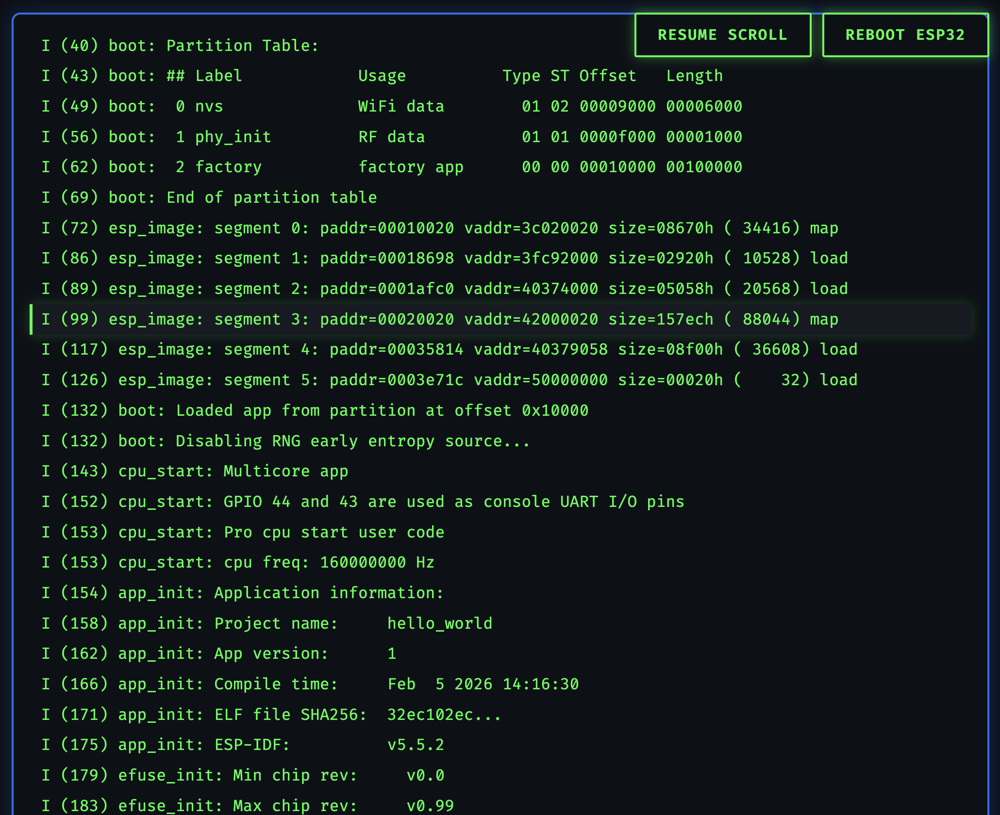

# ESP-Web-Monitor (Premium Serial Web Dashboard)

이 프로젝트는 ESP32의 시리얼 출력을 실시간으로 캡처하여 웹 브라우저에서 모니터링하고 제어할 수 있는 **고성능 웹 기반 개발 환경**입니다. ESP-IDF 인프라와 최적화된 Python Flask 엔진을 결합하여, 기존 터미널보다 강력하고 세련된 시각적 피드백과 0.1초 미만의 즉각적인 하드웨어 제어 기능을 제공합니다.



---

## 🚀 주요 혁신 기능

### ⚡ 하이퍼 패스트 하드 리셋 (Hard Reset)

- **Zero Overhead**: 외부 도구(`esptool` 등)를 호출하지 않고 Python `pyserial`을 통해 DTR/RTS 핀을 직접 전기적으로 제어합니다.
- **Instant Boot**: 시리얼 포트 연결을 유지한 채 칩만 리셋하므로, 부팅 첫 마디(`ROM boot`)부터 단 한 글자도 놓치지 않고 1초 미만으로 즉시 포착합니다.

### 🔄 무중단 로그 동기화 (Sequential Sync)

- **ID 기반 매칭**: 모든 로그에 고유 시퀀스 번호를 부여하여 서버와 브라우저가 통신합니다.
- **No-Freeze UI**: 로그가 초당 수백 줄씩 쏟아져도 브라우저가 멈추지 않으며, 네트워크 지연이 발생해도 누락 없이 모든 로그를 추적합니다.

### 🎨 프리미엄 다크 인터페이스 (GitHub/VS Code Style)

- **Aesthetic Design**: GitHub의 Dark Dimmed 테마와 JetBrains Mono 가독성 폰트를 적용하여 장시간 모니터링에도 눈이 편안합니다.
- **Compact Layout**: 사용자 요청에 따라 행간(Line-height)을 50% 축소하여 한 화면에 더 많은 정보를 집약적으로 보여줍니다.
- **Smooth Interaction**: 새로운 로그가 올라올 때마다 부드러운 페이드인(Fade-in) 애니메이션이 적용되어 시각적 즐거움을 줍니다.

---

## 🛠 기술 스택

- **Firmware**: ESP-IDF v5.5.2 (C Language) - ESP32-S3 등에 최적화
- **Backend**: Python 3.13+, Flask (Optimized Serial Listener)
- **Serial Engine**: PySerial (Binary-level line parsing)
- **Frontend**: Vanilla JS, CSS3 Variables (Reactive UI)

---

## 📂 프로젝트 구조

```text
.
├── README.md               # 프로젝트 상세 설명서
├── build_and_upload.sh     # [서버중지-빌드-플래싱-서버재시작] 올인원 워크플로우
├── serial_web_server.py    # 고성능 시리얼-웹 동기화 엔진
├── .venv/                  # Python 독립 가상 환경
└── hello_world/            # ESP32 ESP-IDF 프로젝트 소스 영역
    ├── main/
    │   └── hello_world_main.c # 시스템 정보 및 ASCII 아트 출력 로직
    └── CMakeLists.txt      # 프로젝트 빌드 타겟 설정
```

---

## 🕹 시작하기

### 1. 환경 준비 및 의존성 설치

```bash
# 1. ESP-IDF 환경 변수 로드 (경로 확인 필요)
source ~/.espressif/v5.5.2/esp-idf/export.sh

# 2. Python 가상환경 활성화 및 필수 패키지 설치
source .venv/bin/activate
pip install flask pyserial
```

### 2. 자동 빌드 및 실행

`build_and_upload.sh` 스크립트 하나로 모든 과정을 처리합니다. 현재 포트는 `/dev/cu.usbmodem2101`에 최적화되어 있습니다.

```bash
chmod +x build_and_upload.sh
./build_and_upload.sh
```

### 3. 실시간 모니터링 접속

브라우저에서 아래 주소로 접속하세요:

- **Dashboard URL**: [http://localhost:8080](http://localhost:8080)

---

## 🖥 상세 기능 가이드

- **STATUS BAR**: 장치의 연결 상태(ONLINE/OFFLINE)와 현재까지 쌓인 전체 로그 개수를 실시간으로 표시합니다.
- **AUTO-SCROLL**: `OFF`로 전환 시 로그가 흐르지 않고 고정되어 특정 시점의 오류 메시지를 정밀하게 분석할 수 있습니다.
- **CLEAR**: 웹 UI에 쌓인 로그를 즉시 비워 화면을 정돈합니다.
- **HARD RESET**: 빨간색 버튼 클릭 시 ESP32의 `EN` 핀에 즉각적인 리셋 신호를 보내 장치를 처음부터 다시 시작시킵니다.

---

## 📝 개발 가이드 및 팁

1. **시리얼 포트 충돌 주의**: 터미널에서 `idf.py monitor`를 동시에 실행하면 포트 점유 충돌이 발생합니다. 웹 모니터를 사용할 때는 터미널 모니터를 종료하세요.
2. **Device Path**: 맥에서 USB 포트를 옮겨 꽂으면 포트 이름(예: `cu.usbmodem2101`)이 바뀔 수 있습니다. 이 경우 `serial_web_server.py` 상단의 `SERIAL_PORT` 값을 확인하세요.
3. **메모리 최적화**: 웹 브라우저의 성능을 위해 최대 1000줄의 로그만 유지하며, 그 이상의 로그는 오래된 순으로 자동 삭제됩니다.

---

Created by **Antigravity AI Assistant** for **Jinho Jung**
v2.0 - High Performance & Premium UI Update
